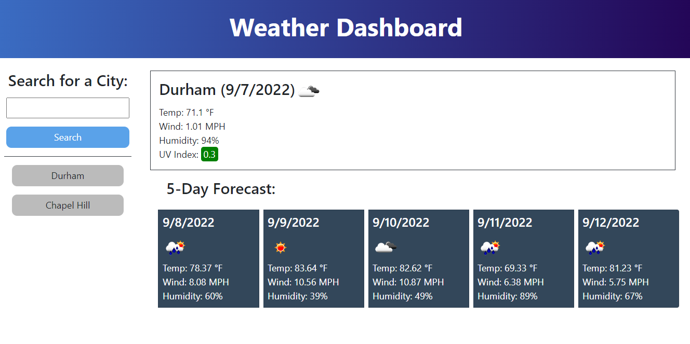

# Weather-Dashboard

## Description

An app where you can search the weather for different cities. You can see the current weather including; the date, conditions, temperature, humidity, wind speed, and the UV Index. You can also see the five day forecast. Searches are saved in local storage and loaded as buttons on the side.

## Image

## Built With

- HTML
- CSS
- Javascript
- OpenWeather One Call API

## Website

https://jonathangibbings.github.io/Weather-Dashboard/

## Contribution

Made by Jonathan Gibbings
